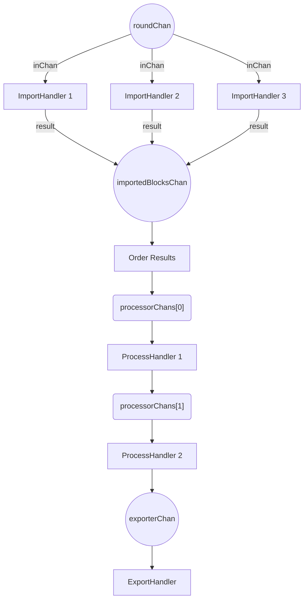
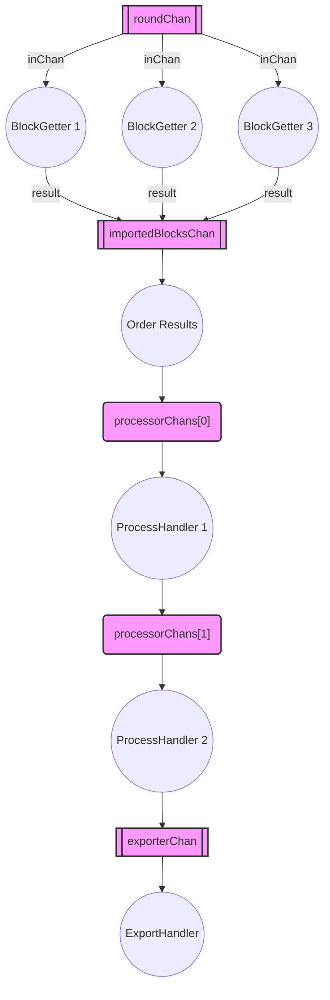
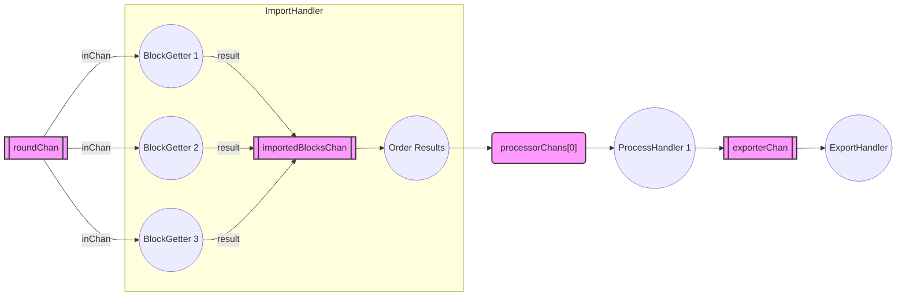

# PostgreSQL Exporter

Write block data to a postgres database.

The database maintained by this plugin is designed to serve the Indexer API.

## Connection string

The connection string is defined by the [pgx](https://github.com/jackc/pgconn) database driver.

For most deployments, you can use the following format:

```psql
host={url} port={port} user={user} password={password} dbname={db_name} sslmode={enable|disable}
```

For additional details, refer to the [parsing documentation here](https://pkg.go.dev/github.com/jackc/pgx/v4/pgxpool@v4.11.0#ParseConfig).

## Data Pruning

The delete-task prunes old transactions according to its configuration. This can be used to limit the size of the database.

## Configuration

```yml @sample.yaml
name: postgresql
config:
    # Pgsql connection string
    # See https://github.com/jackc/pgconn for more details
    connection-string: "host= port=5432 user= password= dbname="
  
    # Maximum connection number for connection pool
    # This means the total number of active queries that can be running
    # concurrently can never be more than this
    max-conn: 20
  
    # The delete task prunes old transactions according to its configuration.
    # By default transactions are not deleted.
    delete-task:
        # Interval used to prune the data. The values can be -1 to run at startup,
        # 0 to disable, or N to run every N rounds.
        interval: 0
    
        # Rounds to keep
        rounds: 100000
```

## TODO - Mermaid



### V2



### V3


