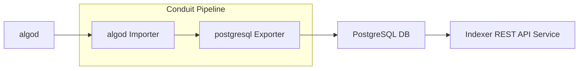

# Using Conduit to Populate an Indexer Database

<!-- TODO: write a short readme that does this, but using a docker compose file -->

This document explains how to configure and deploy Conduit to populate a
PostgreSLQ DB suitable to serve as a backend for the [Indexer](https://github.com/algorand/indexer/) API.
This is not a production deployment. Treat this tutorial as an example configuration.
Each of the components described below have their own requirements for managing
deployments, upgrades, scaling, and high availability.

The components you will configure and deploy are:
* algod node configured with follow mode.
* PostgreSQL database to hold the processed data.
* Conduit pipeline configured to pull data from algod and push it to the PostgreSQL database.
* Indexer API served from PostgreSQL.



## Pre-requisites

* Linux or Mac Operating System.
* Docker, used for the database.

## Node (algod with follow mode)

This is the blockchain data source. When in [follow mode](follow-mode-doc), algod is controlled by Conduit to ensure the two services are always operating on the same block. In this way algod is able to
store the minimum number of blocks required to stream data to Conduit.

We will cover a basic installation using `update.sh`, for [additional
information refer to the developer portal.](node-install-doc)

```bash
# Download update.sh script.
wget https://raw.githubusercontent.com/algorand/go-algorand/rel/stable/cmd/updater/update.sh

# Define which network to run on. This selects the correct genesis file.
# Options: mainnet, testnet, betanet, devnet
NETWORK=mainnet

# Download algod binaries and initialize data directory.
./update.sh -n -i -c stable -p bin -d algod_data -g $NETWORK

# Configure node to use the Conduit profile.
./bin/algocfg profile set conduit -d algod_data
```

At this stage you have all of the algod tools in `bin` and an `algod_data`
directory configured for Conduit.

Start the node:
```bash
./bin/goal node start -d algod_data
```

Check node status:
```bash
./bin/goal node status -d algod_data
```

When finished, this command will stop the node:
```bash
./bin/goal node stop -d algod_data
```


## PostgreSQL

This document cannot go into the complete details for configuring your
database. PostgreSQL or a compatible database like Amazon Aurora are suitable
for the Indexer API. See the [Indexer](indexer-readme) documentation more details.

For this tutorial the process is simplified by using a local docker image.

The following credentials are used for the container and will be used in the next steps when configuring
Conduit and Indexer:
* `PORT`: 5555
* `USER`: algorand
* `PASS`: pgpass
* `DB`: conduit

Launch the container:
```bash
docker run -d --name local-database -p 5555:5432 -e POSTGRES_PASSWORD=pgpass -e POSTGRES_USER=algorand -e POSTGRES_DB=conduit postgres
```

When finished, shutdown and remove the database with the following commands:
```bash
docker kill local-database
docker rm local-database
```

## Conduit

Now we will configure Conduit to import data from `algod` and export to `PostgreSQL`.

Download the `conduit` binary [from the releases page](conduit-release). Put
the binary in the current working directory, or install it to your path and use
normally.

Create and initialize Conduit data directory:
```bash
mkdir conduit_data
./conduit init --importer algod --exporter postgresql > conduit_data/conduit.yml
```

This will set up a new Conduit data directory with a configuration template.
The template needs to be edited. We'll use dot notation to indicate a path in the config file. For example,
`importer.config.netaddr` refers to:
```yaml
importer:
  config:
    netaddr: "this is the field we are referring to"
```

Finish configuring Conduit by setting the following values in `conduit_data/conduit.yml`:
* `importer.config.netaddr`: the contents of `algod_data/algod.net`, with a `http://` prefix. Typically this defaults to `http://127.0.0.1:8080`.
* `importer.config.token`: the contents of `algod_data/algod.token`
* `exporter.config.connection-string`: `host=localhost port=5555 user=algorand password=pgpass dbname=conduit`

If you are connecting to an existing PostgreSQL database, you can also set
the admin token at `importer.config.catchup-config.admin-token` to the contents of `algod_data/algod.admin.token`.
When the admin token is configured, Conduit will initialize the node by using fast catchup.
The latest round will be fetched from the database for Conduit to use.

Review the inline documentation in `conduit.yml` and decide if there are any
other settings you would like to update.

Start Conduit with:
```bash
./conduit -d conduit_data
```

## Indexer API

With data in PostgreSQL, you can now start the [Indexer API](indexer-read-only).

Download Indexer 3.x [from the releases page](indexer-release). Put
the `algorand-indexer` binary in the current working directory, or install it to your path and use
normally.

Start Indexer with:
```bash
./algorand-indexer daemon -S ":8980" --data-dir /tmp --postgres "host=localhost port=5555 user=algorand password=pgpass dbname=conduit"
```

To test that it's working, here is an example API call:
```bash
curl http://localhost:8980/v2/accounts
```

More information about Indexer can be found in the [Indexer README](indexer-readme) and the [Indexer API documentation](indexer-rest-api).

[follow-mode-doc]: https://github.com/algorand/go-algorand/blob/master/docs/follower_node.md
[node-install-doc]: https://developer.algorand.org/docs/run-a-node/setup/install/
[conduit-release]: https://github.com/algorand/conduit/releases
[indexer-readme]: https://github.com/algorand/indexer/#readme
[indexer-read-only]: https://github.com/algorand/indexer#read-only
[indexer-release]: https://github.com/algorand/indexer/releases
[indexer-rest-api]: https://developer.algorand.org/docs/rest-apis/indexer/
