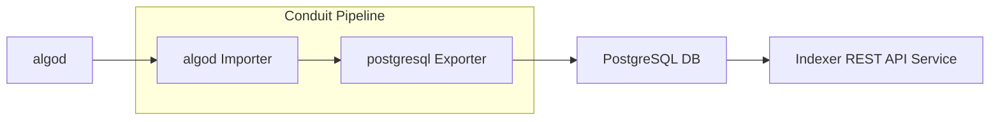

# Conduit Indexer Writer

This document explains how to configure and deploy Conduit to populate a
PostgreSLQ DB suitable to serve as a backend for the Indexer API.

Note: Windows is not currently supported by algod.

The components you will configure and deploy are:
* Algod configured as a blockchain follower.
* PostgreSQL database.
* Conduit configured to pull data from algod and push it to PostgreSQL



## Algod

To source data from the blockchain algod is used. It will be controlled by
Conduit in order to run synchronously. In this way it is able to store a
minimal subset of data required for streaming data through Conduit.

We will cover a basic installation using `update.sh`, for [additional
information refer to the developer portal.](node-install-doc)

```bash
# download update.sh
wget https://raw.githubusercontent.com/algorand/go-algorand/rel/stable/cmd/updater/update.sh
# Select mainnet genesis file.
# Options: mainnet, testnet, betanet, devnet
NETWORK=mainnet
# download binaries and initialize data directory.
update.sh -n -i -c stable -p bin -d algod_data -g $NETWORK
# configure node to work with conduit
./bin/algocfg profile set conduit -d algod_data
```

At this stage you have all of the algod tools in `bin` and a `algod_data`
directory configured for Conduit with the desired network.

Start the node with `./bin/goal node start -d algod_data`

## PostgreSQL

This document cannot go into the complete details for configuring your
database. PostgreSQL or compatible database like Amazon Aurora are suitable
for the Indexer API. The [Indexer](indexer-readme) documentation more details.

For this tutorial we'll simplify things with a local docker image. This will
launch a container:
```bash
docker run -d --name local-database -p 5555:5432 -e POSTGRES_PASSWORD=pgpass -e POSTGRES_USER=algorand -e POSTGRES_DB=conduit postgres
```

The credentials used are all required for the next step when we configure
Conduit:
* `PORT`: 5555
* `USER`: algorand
* `PASS`: pgpass
* `DB`: conduit

## Conduit

Now configure Conduit to source data from `algod` and export to `PostgreSQL`.

Download the `conduit` command [from the releases page](conduit-release). Put
the binary in the current working directory, or install it to your path and use
normally.

Create conduit data directory:
```bash
./conduit  init --importer algod --exporter postgresql --data conduit_data
```

This will setup a new Conduit data directory with a configuration template.
To finish the process, edit `conduit.yml` with the following changes, we'll
use dot notation to indicate a path in the config file. For example
`importer.config.netaddr` refers to:
```yaml
importer:
  config:
    netaddr: "this field"
```

Configuration:
* `importer.config.netaddr`: the contents of `algod_data/algod.net`, with a `http://` prefix. Typically this defaults to `http://127.0.0.1:8080`.
* `importer.config.token`: the contents of `algod_data/algod.token`
* `exporter.config.connection-string`: `host=localhost port=5555 user=algorand password=pgpass dbname=conduit`

If you are connecting to an existing PostgreSQL database, you can also set a
catchpoint and the admin token. If those are set Conduit will automatically
initialize the node using fast catchup.

Review the inline documentation in `conduit.yml` and decide if there are any
other settings you would like to update.

At this point you may start conduit with `./conduit -d conduit_data`

[node-install-doc]: https://developer.algorand.org/docs/run-a-node/setup/install/
[indexer-readme]: https://github.com/algorand/indexer/#readme
[conduit-release]: https://github.com/algorand/conduit/releases
